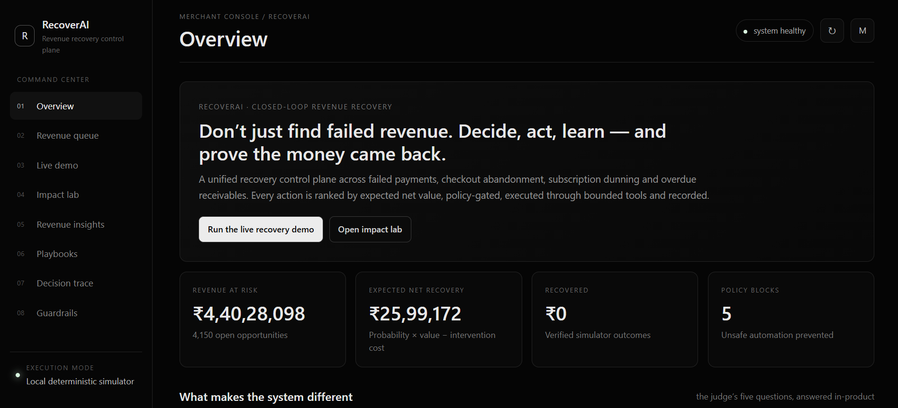

# RecoverAI

> **An AI-powered revenue recovery control plane that detects revenue at risk, determines the best recovery action, executes it within merchant-defined guardrails, and tracks the outcome.**

RecoverAI helps merchants recover revenue that would otherwise be lost due to failed payments, checkout abandonment, subscription failures, and overdue receivables.

Instead of treating every revenue-loss event with the same retry or reminder strategy, RecoverAI combines machine learning, contextual decision-making, policy enforcement, and bounded automation to determine **what action should be taken, whether it is safe to take automatically, and whether the action actually recovered revenue.**

---

## Overview

Revenue leakage rarely happens through a single failure.

A customer may:

* Experience a temporary payment failure

* Abandon checkout

* Have a subscription payment fail

* Become overdue on an invoice

* Encounter a payment-method problem

* Require a different recovery intervention

Traditional systems often respond with fixed rules such as:

```text

Payment Failed → Retry

Invoice Overdue → Send Reminder

```

RecoverAI turns this into an intelligent closed-loop workflow:

```text

Detect

  ↓

Diagnose

  ↓

Predict

  ↓

Decide

  ↓

Apply Guardrails

  ↓

Execute

  ↓

Observe Outcome

  ↓

Measure Revenue Recovered

  ↓

Audit

```

The goal is not to maximize the number of recovery actions.

The goal is to **maximize safe and measurable recovered revenue.**

---

## Product Overview



*RecoverAI homepage overview — revenue risk, recovery opportunities, expected value, and recovery controls in one view.*

---

# Key Features

## 1. Revenue Opportunity Detection

RecoverAI identifies multiple types of revenue leakage and converts them into actionable recovery opportunities.

Supported revenue rails include:

* Failed payments

* Checkout abandonment

* Subscription dunning

* Overdue receivables

Each opportunity contains contextual information such as:

* Amount at risk

* Revenue type

* Failure reason

* Customer information

* Historical payment behavior

* Recovery probability

* Recommended intervention

* Recovery cost

* Retry/reminder history

---

## 2. ML-Based Recovery Prediction

The machine learning layer estimates the probability that an opportunity can be successfully recovered.

The prediction is based on features such as:

* Transaction amount

* Payment failure reason

* Customer payment history

* Previous successful payments

* Retry history

* Customer segment

* Revenue rail

* Payment behavior

The model produces a recovery probability:

```text

Recovery Probability = P(Revenue can be recovered)

```

This probability is then used by the decision engine to prioritize opportunities and select appropriate interventions.

---

## 3. Intelligent Recovery Decisioning

RecoverAI does not apply a single action to every opportunity.

Instead, the recovery agent evaluates the context and determines an appropriate intervention.

Example:

```text

BANK_TIMEOUT

      ↓

RETRY_PAYMENT

```

```text

INSUFFICIENT_FUNDS

      ↓

SCHEDULE_RETRY

```

```text

CARD_EXPIRED

      ↓

GENERATE_PAYMENT_LINK

```

```text

HIGH_VALUE OPPORTUNITY

      ↓

ESCALATE FOR REVIEW

```

The system therefore moves from simple rule-based retries toward **context-aware recovery orchestration**.

---

# 4. Expected Net Value Prioritization

RecoverAI prioritizes opportunities according to their expected financial value rather than simply sorting them by probability or transaction amount.

A simplified expected-value calculation is:

```text

Expected Recovery Value

    = Amount at Risk × Recovery Probability

```

Recovery costs are then considered:

```text

Expected Net Value

    = Expected Recovery Value − Recovery Cost

```

For example:

```text

Opportunity A

Amount: ₹1,000

Recovery probability: 90%

Cost: ₹5

Expected Net Value

\= ₹1,000 × 0.90 − ₹5

\= ₹895

```

This allows the merchant to focus recovery efforts where they have the greatest expected economic impact.

---

# 5. Counterfactual Decisioning

For important recovery opportunities, RecoverAI can compare alternative interventions.

For example:

```text

Payment Opportunity

        │

        ├── Retry Payment

        ├── Schedule Retry

        ├── Send Reminder

        ├── Generate Payment Link

        └── Escalate

```

The decision layer evaluates the available alternatives and selects the most appropriate action based on the opportunity context and expected value.

This provides greater explainability than simply returning:

```text

Recommended Action: Retry

```

Instead, the system can explain why one intervention is preferred over alternatives.

---

# 6. Policy Engine and Guardrails

Financial actions should not be executed solely because an AI model recommends them.

RecoverAI separates **decision-making from authorization**.

The architecture follows:

```text

Model

  ↓

Agent

  ↓

Policy Engine

  ↓

Tool Execution

```

The policy engine enforces merchant-defined constraints such as:

* Maximum retry count

* Maximum reminder count

* Maximum automatic recovery amount

* High-value transaction threshold

* Recovery cost limits

* Automation enable/disable state

* Fraud-related restrictions

* Human-review requirements

* Stopping conditions

Example:

```text

AI Agent:

"Retry Payment"

        ↓

Policy Engine:

"Amount exceeds automatic recovery limit"

        ↓

Action:

"Escalate for human review"

```

This provides a controlled boundary around autonomous financial actions.

---

# 7. Bounded Recovery Workflows

RecoverAI executes recovery actions within predefined boundaries.

A recovery workflow can contain:

```text

Opportunity

    ↓

Recommended Action

    ↓

Policy Check

    ↓

Approval / Rejection

    ↓

Execution

    ↓

Provider Response

    ↓

Outcome

```

The system avoids uncontrolled retry loops by enforcing stopping rules.

---

# 8. Recovery Playbooks

RecoverAI uses recovery playbooks to map different failure conditions to suitable interventions.

Example playbook:

\| Condition              | Recovery Strategy     |

\| ---------------------- | --------------------- |

\| Bank timeout           | Retry payment         |

\| UPI timeout            | Retry payment         |

\| Network error          | Retry payment         |

\| Insufficient funds     | Schedule retry        |

\| Expired card           | Generate payment link |

\| Authentication failure | Generate payment link |

\| Unknown failure        | Send reminder         |

\| High-value transaction | Human review          |

\| Disputed receivable    | Human review          |

Playbooks provide a structured decision layer while allowing the recovery engine to remain adaptable to different opportunity types.

---

# 9. Multiple Revenue Recovery Rails

RecoverAI is designed as a unified recovery control plane rather than a single failed-payment retry tool.

### Failed Payments

Detect payment failures and determine whether a retry, delayed retry, alternative payment surface, or escalation is appropriate.

### Checkout Abandonment

Identify abandoned checkout opportunities and determine whether a customer reminder or payment-link intervention is appropriate.

### Subscription Dunning

Identify failed recurring payments and coordinate bounded retry and reminder strategies.

### Receivables

Identify overdue receivables and apply structured reminder or escalation workflows.

All of these use the same underlying recovery lifecycle:

```text

Detect → Predict → Decide → Gate → Recover → Measure

```

---

# 10. Revenue Insights

RecoverAI provides an analytical view of where revenue leakage is occurring.

The system can analyze revenue risk by:

* Revenue rail

* Failure reason

* Customer segment

* Transaction value

* Recovery probability

* Expected recovery value

* Recovery outcome

This helps answer questions such as:

```text

Where is the merchant losing the most revenue?

Which failure reasons are most recoverable?

Which recovery actions generate the highest expected value?

Which customer segments contribute the most recoverable revenue?

```

---

# 11. Impact Analysis

RecoverAI evaluates recovery strategies across a batch rather than relying on a single successful transaction.

The system compares a baseline strategy against the intelligent recovery strategy.

Example:

```text

Baseline Recovery

        vs

RecoverAI Recovery

```

Metrics include:

* Expected recovered revenue

* Net recovered value

* Recovery rate

* Incremental value

* Recovery lift

* Action distribution

* Revenue contribution by recovery rail

This provides a quantitative view of the economic impact of the recovery strategy.

---

# 12. Audit Trail

Every important decision and recovery action can be recorded.

The audit trail captures information such as:

* Opportunity

* Recommended action

* Policy decision

* Execution result

* Provider response

* Recovery outcome

* Timestamp

* Reasoning context

Conceptually:

```text

Opportunity Detected

        ↓

Prediction Generated

        ↓

Action Selected

        ↓

Policy Evaluated

        ↓

Action Executed

        ↓

Outcome Recorded

```

This makes financial automation traceable and explainable.

---

# 13. Graceful Failure Handling

External payment systems can fail.

RecoverAI treats provider failures as explicit workflow outcomes rather than continuously retrying.

Example:

```text

Recovery Action

      ↓

Provider Error

      ↓

Retry Limit / Failure Condition

      ↓

Stop

      ↓

Escalate

      ↓

Audit Event

```

This prevents uncontrolled automation and ensures that failure is visible to the merchant.

---

# AI and ML Concepts

RecoverAI combines several concepts into a single financial workflow.

### Supervised Machine Learning

Used to estimate the probability that a revenue opportunity can be recovered.

### Classification

The recovery model predicts the likelihood of successful recovery.

### Probability Estimation

The model produces a recovery probability rather than only a binary prediction.

### Feature Engineering

Transaction, customer, failure, behavioral, and opportunity-level attributes are transformed into model features.

### Train/Test Evaluation

The model is trained on one portion of the synthetic dataset and evaluated on a held-out test set.

### Precision and Recall

Used to evaluate the quality of recovery predictions.

### F1 Score

Provides a combined measure of precision and recall.

### ROC-AUC

Measures the model's ability to distinguish recoverable and non-recoverable opportunities.

### PR-AUC

Measures precision-recall performance, particularly useful when positive recovery outcomes are less frequent.

### Expected Value Optimization

Recovery actions are evaluated according to their expected economic value.

### Counterfactual Decisioning

Alternative interventions are evaluated to determine which action is most appropriate.

### Rule-Based Policy Enforcement

Hard financial constraints are enforced independently of model predictions.

### Agentic Workflow

The system follows a multi-step loop:

```text

Observe

  ↓

Reason

  ↓

Select Action

  ↓

Check Policy

  ↓

Execute Tool

  ↓

Observe Result

```

---

# System Architecture

```text

                        ┌─────────────────────┐

                        │      Frontend       │

                        │ HTML / CSS / JS     │

                        └──────────┬──────────┘

                                   │

                                   ▼

                        ┌─────────────────────┐

                        │     FastAPI API     │

                        └──────────┬──────────┘

                                   │

             ┌─────────────────────┼─────────────────────┐

             │                     │                     │

             ▼                     ▼                     ▼

     ┌───────────────┐     ┌───────────────┐     ┌───────────────┐

     │ Opportunity   │     │ ML Prediction │     │ Agent Planner │

     │ Engine        │     │ Engine        │     │               │

     └───────────────┘     └───────────────┘     └───────┬───────┘

                                                         │

                                                         ▼

                                                 ┌───────────────┐

                                                 │ Policy Engine │

                                                 └───────┬───────┘

                                                         │

                                                         ▼

                                                 ┌───────────────┐

                                                 │ Recovery Tools│

                                                 └───────┬───────┘

                                                         │

                                      ┌──────────────────┴──────────────────┐

                                      ▼                                     ▼

                              ┌───────────────┐                     ┌───────────────┐

                              │ Razorpay Test │                     │ Local Payment │

                              │ Mode Adapter  │                     │ Simulator     │

                              └───────────────┘                     └───────────────┘

                                      │                                     │

                                      └──────────────────┬──────────────────┘

                                                         ▼

                                                 ┌───────────────┐

                                                 │ Audit &       │

                                                 │ Outcome Store │

                                                 └───────────────┘

```

---

# End-to-End Workflow

## Step 1 — Detect

Revenue-loss events are converted into recovery opportunities.

```text

Payment Failure

Checkout Abandonment

Subscription Failure

Overdue Receivable

```

↓

## Step 2 — Enrich

The opportunity is enriched with contextual information:

```text

Customer

Transaction

History

Failure Reason

Revenue Type

Previous Attempts

Risk Signals

```

↓

## Step 3 — Predict

The ML model estimates:

```text

Recovery Probability

```

↓

## Step 4 — Decide

The recovery agent determines the appropriate intervention.

```text

Retry

Schedule Retry

Payment Link

Reminder

Escalation

Stop

```

↓

## Step 5 — Rank

The system calculates expected financial value and prioritizes opportunities.

```text

Expected Net Value

```

↓

## Step 6 — Gate

Merchant policies determine whether the proposed action can be executed automatically.

```text

Allowed

Blocked

Escalated

```

↓

## Step 7 — Execute

The recovery tool performs the bounded action.

↓

## Step 8 — Observe

The system receives the provider result.

```text

Recovered

Failed

Pending

Escalated

```

↓

## Step 9 — Measure

Recovered revenue and recovery performance are recorded.

↓

## Step 10 — Audit

The complete decision and execution history is stored.

---

# Technology Stack

## Frontend

* HTML5

* CSS3

* Vanilla JavaScript

* Fetch API

* Responsive dashboard UI

The frontend uses a lightweight architecture without a large client-side framework.

---

## Backend

* Python

* FastAPI

* Uvicorn

* Pydantic

FastAPI provides the REST API and serves the frontend application.

---

## Machine Learning

* scikit-learn

* Random Forest classifier

* NumPy


The ML pipeline handles:

```text

Feature Preparation

        ↓

Train/Test Split

        ↓

Model Training

        ↓

Probability Prediction

        ↓

Evaluation

```

---

## Database

* SQLite


SQLite stores:

* Payments

* Customers

* Recovery opportunities

* Recovery actions

* Campaigns

* Audit events

* Model evaluation information

---

## Payment Integration

* Razorpay Test Mode

* Razorpay Payment Links

* Razorpay webhook support

* Local payment simulator

The local simulator allows the complete recovery workflow to operate without requiring live payment credentials.

---

# Project Structure

```text

recoverai/

│

├── app/

│   ├── main.py

│   ├── config.py

│   ├── db.py

│   ├── models.py

│   ├── ml.py

│   ├── agent.py

│   ├── policy.py

│   ├── opportunities.py

│   ├── integrations.py

│   ├── data_generator.py

│   │

│   └── static/

│       ├── index.html

│       ├── style.css

│       └── app.js

│

├── data/

│   └── recoverai.db

│

├── models/

│   └── recovery_model.joblib

│

├── tests/

│   └── test_api.py

│

├── requirements.txt

├── .env.example

├── run.bat

├── run.ps1

├── run.sh

└── README.md

```

---

# Data Model

The core entities are:

```text

Customer

    │

    ├── Payments

    │

    └── Opportunities

             │

             ├── Recovery Actions

             │

             ├── Policy Decisions

             │

             └── Audit Events

```

### Customer

Stores customer-level information and payment behavior.

### Payment

Represents a payment attempt and its associated transaction information.

### Opportunity

Represents revenue that is currently at risk and potentially recoverable.

### Recovery Action

Represents an intervention selected or executed for an opportunity.

### Campaign

Represents a grouped recovery strategy applied to a set of opportunities.

### Audit Event

Stores important events throughout the recovery lifecycle.

---

# Synthetic Data

RecoverAI includes a synthetic merchant dataset for development and evaluation.

The generated dataset contains thousands of payment and revenue-loss records with realistic variations across:

* Payment outcomes

* Failure reasons

* Transaction values

* Customer behavior

* Revenue rails

* Recovery outcomes

Synthetic data makes it possible to evaluate the system without exposing real customer or payment information.

---

# Evaluation Metrics

The ML component can be evaluated using:

```text

Precision

Recall

F1 Score

ROC-AUC

PR-AUC

```

Business-level evaluation includes:

```text

Revenue at Risk

Expected Recovery

Recovered Revenue

Recovery Rate

Recovery Cost

Expected Net Value

Incremental Value

Recovery Lift

```

This allows both **model quality** and **business impact** to be evaluated.

---

# Razorpay Integration

RecoverAI supports integration with Razorpay Test Mode for payment recovery workflows.

The Razorpay integration is isolated behind a payment adapter so that the application can operate using either:

```text

Local Simulator

```

or:

```text

Razorpay Test Mode

```

This separation allows the recovery engine and policy layer to remain independent of the underlying payment provider.

Payment actions can include generating a fresh payment surface through Razorpay Payment Links.

Webhook handling can be used to receive asynchronous payment-state changes and update the recovery lifecycle.

---

# API

The backend exposes REST endpoints for the main application workflows.

Examples include:

```text

GET  /api/overview

GET  /api/opportunities

GET  /api/opportunities/{id}

GET  /api/analytics

GET  /api/insights

GET  /api/playbooks

GET  /api/audit

GET  /api/settings

POST /api/opportunities/{id}/execute

POST /api/campaigns

GET  /api/impact

POST /api/webhooks/razorpay

```

FastAPI also provides interactive API documentation through:

```text

/docs

```

---

# Configuration

Environment configuration is stored in `.env`.

Example:

```env

APP_NAME=RecoverAI

DATABASE_PATH=./data/recoverai.db

USE_RAZORPAY=false

RAZORPAY_KEY_ID=

RAZORPAY_KEY_SECRET=

RAZORPAY_WEBHOOK_SECRET=


```

The local simulator can be used without Razorpay credentials.

---

# Running the Project

Create a virtual environment:

```bash

python -m venv .venv

```

Activate it on Windows:

```powershell

.\\.venv\Scripts\Activate.ps1

```

Install dependencies:

```bash

pip install -r requirements.txt

```

Create the environment file:

```powershell

Copy-Item .env.example .env

```

Start the application:

```bash

python -m uvicorn app.main:app --reload

```

The application will be available at:

```text

http://127.0.0.1:8000

```

API documentation:

```text

http://127.0.0.1:8000/docs

```

---

# Design Principles

RecoverAI is built around several core principles.

### Revenue First

The system optimizes for recovered economic value rather than simply increasing the number of automated actions.

### Explainable Decisions

Recovery decisions are accompanied by contextual reasoning and alternative-action analysis.

### Bounded Autonomy

AI recommendations are subject to explicit merchant-defined policies.

### Human Escalation

High-value, ambiguous, or restricted situations can be routed to human review.

### Failure Awareness

External failures are treated as workflow states and do not result in uncontrolled automation.

### Auditability

Important decisions and actions are recorded for traceability.

### Measurement

The system measures both model performance and financial recovery outcomes.

---

# Core Design Philosophy

RecoverAI separates the responsibilities of different components:

```text

ML Model

"What is likely to happen?"

Agent

"What should we do?"

Policy Engine

"Are we allowed to do it?"

Recovery Tool

"Execute the action."

Outcome Engine

"What happened?"

Audit Layer

"What did the system do and why?"

```

This separation allows intelligent automation while maintaining control over financial actions.

---

# Recovery Lifecycle

```text

                ┌──────────────┐

                │ Revenue Risk │

                └──────┬───────┘

                       ↓

                ┌──────────────┐

                │  Detection   │

                └──────┬───────┘

                       ↓

                ┌──────────────┐

                │  Prediction  │

                └──────┬───────┘

                       ↓

                ┌──────────────┐

                │   Decision   │

                └──────┬───────┘

                       ↓

                ┌──────────────┐

                │ Policy Gate  │

                └──────┬───────┘

                       ↓

                ┌──────────────┐

                │  Execution   │

                └──────┬───────┘

                       ↓

                ┌──────────────┐

                │   Outcome    │

                └──────┬───────┘

                       ↓

                ┌──────────────┐

                │   Measure    │

                └──────┬───────┘

                       ↓

                ┌──────────────┐

                │     Audit    │

                └──────────────┘

```

---

# Summary

RecoverAI transforms revenue recovery from a collection of static retry and reminder rules into an intelligent, measurable, and controlled workflow.

It combines:

* **Machine learning** for recovery prediction

* **Agentic decision-making** for intervention selection

* **Expected-value optimization** for revenue prioritization

* **Counterfactual analysis** for explainability

* **Policy engines** for financial guardrails

* **Bounded tools** for recovery execution

* **Razorpay Test Mode** for payment integration

* **Batch evaluation** for measurable impact

* **Audit trails** for accountability

The fundamental principle is:

```text

Predict intelligently.

Decide contextually.

Act within boundaries.

Measure the money.

Prove what happened.

```
